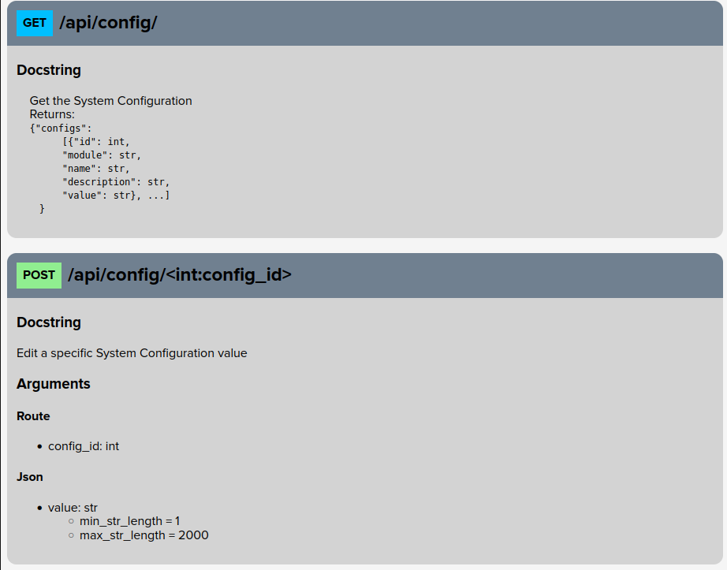

# Flask Parameter Validation
### Get and validate all Flask input parameters with ease.

## Install
* Pip: Install with `pip install flask_parameter_validation`.
* Manually:
  - `git clone https://github.com/Ge0rg3/flask-parameter-validation.git`
  - `python setup.py install`


## Simple Usage
```py
from flask import Flask
from typing import List, Optional
from flask_parameter_validation import ValidateParameters, Route, Json, Query
from datetime import datetime

app = Flask(__name__)


@app.route("/update/<int:id>", methods=["POST"])
@ValidateParameters()
def hello(
        id: int = Route(),
        username: str = Json(min_str_length=5, blacklist="<>"),
        age: int = Json(min_int=18, max_int=99),
        nicknames: List[str] = Json(),
        date_of_birth: datetime = Json(),
        password_expiry: Optional[int] = Json(5),
        is_admin: bool = Query(False),
        user_type: str = Json(alias="type")
     ):
    return "Hello World!"


if __name__ == "__main__":
    app.run()
```

## Detailed Usage
1. We use the ValidateParameters decorator on all functions that this modules should be used in.
2. The format for arguments is as follows:
`parameter_name: parameter_type = Class()`
In this example, `parameter_name` would be the field name itself, such as "username". `parameter_type` would be the expected python data type, such as str, int, List, Union etc. Finally, `Class()` is one of the class inputs, as detailed below:

### Classes
1. Route()  
This is the data passed through the URL, such as `/users/<int:id>`
2. Form()  
This is the data passed by a normal HTML form, often with x-www-form-urlencoded content-type.
3. Json()  
This is any JSON body sent -- request must have application/json content type for flask to read this.
4. Query()  
This covers query parameters (aka GET parameters), such as `/news/article?id=55`
5. File()  
The validation on files are different to the others, but file input can still be obtained here as their Flask FileStorage objects.

### Input types
* str
* int
* bool
* float
* typing.List (must use this, not just `list`)
* typing.Union
* typing.Optional
* datetime.datetime
* datetime.date
* datetime.time

### Validation
All parameters can have default values, and automatic validation.  
`Route`, `Form`, `Json` and `Query` have the following options:
* default: any, Specifies the default value for the field.
* min_str_length: int, Specifies the minimum character length for a string input
* max_str_length: int, Specifies the maximum character length for a string input
* min_list_length: int, Specifies the minimum number of elements in a list
* max_list_length: int, Specifies the maximum number of elements in a list
* min_int: int, Specifies the minimum number for an int input
* max_int: int, Specifies the maximum number for an int input
* whitelist: str, A string containing allowed characters for the value
* blacklist: str, A string containing forbidden characters for the value
* pattern: str, A regex pattern to test for string matches
* func: Callable -> Union[bool, tuple[bool, str]], A function containing a fully customized logic to validate the value
* datetime_format: str, datetime format string ([datetime format codes](https://docs.python.org/3/library/datetime.html#strftime-and-strptime-format-codes))
* comment: str, A string to display as the argument description in generated documentation (if used)
* alias: str, An expected parameter name instead of the function name. See `access_type` example for clarification.

`File` has the following options:
* content_types: array of strings, an array of allowed content types.
* min_length: Minimum content-length for a file
* max_length: Maximum content-length for a file

These validators are passed into the classes in the route function, such as:
* `username: str = Json("defaultusername", min_length=5)`
* `profile_picture: werkzeug.datastructures.FileStorage = File(content_types=["image/png", "image/jpeg"])`
* `filter: str = Query()`

Note: For `typing.List` Query inputs, users can pass via either `value=1&value=2&value=3`, or `value=1,2,3`. Both will be transformed to a list. 

### Overwriting default errors
By default, the error messages are returned as a JSON response, with the detailed error in the "error" field. However, this can be edited by passing a custom error function into the ValidateParameters decorator. For example:
```py
def error_handler(err):
    error_name = type(err)
    error_parameters = err.args
    error_message = str(err)
    return {
        "error_name": type(err).__name__,
        "error_parameters": err.args,
        "error_message": str(err)
    }, 400

@ValidateParameters(error_handler)
def api(...)
```

### API Documentation
Using the data provided through parameters, docstrings, and Flask route registrations, Flask Parameter Validation can generate an API Documentation page. To make this easy to use, it comes with a blueprint and the configuration options below:
* `FPV_DOCS_SITE_NAME: str`: Your site's name, to be displayed in the page title, default: `Site`
* `FPV_DOCS_CUSTOM_BLOCKS: array`: An array of dicts to display as cards at the top of your documentation, with the (optional) keys:
  * `title: Optional[str]`: The title of the card
  * `body: Optional[str] (HTML allowed)`: The body of the card
  * `order: int`: The order in which to display this card (out of the other custom cards)
* `FPV_DOCS_DEFAULT_THEME: str`: The default theme to display in the generated webpage

#### Included Blueprint
The documentation blueprint can be added using the following code:
```py
from flask_parameter_validation.docs_blueprint import docs_blueprint
...
app.register_blueprint(docs_blueprint)
```

The default blueprint adds two `GET` routes:
* `/`: HTML Page with Bootstrap CSS and toggleable light/dark mode
* `/json`: JSON Representation of the generated documentation

The `/json` route yields a response with the following format:
```json
{
  "custom_blocks": "<array entered in the FPV_DOCS_CUSTOM_BLOCKS config option, default: []>",
  "default_theme": "<string entered in the FPV_DOCS_DEFAULT_THEME config option, default: 'light'>",
  "docs": "<see get_docs_arr() return value format below>",
  "site_name": "<string entered in the FPV_DOCS_SITE_NAME config option, default: 'Site'"
}
```

##### Example with included Blueprint
Code:
```py
@config_api.get("/")
@ValidateParameters()
def get_all_configs():
    """
    Get the System Configuration
    Returns:
    <code>{"configs":
        [{"id": int,
        "module": str,
        "name": str,
        "description": str,
        "value": str}, ...]
    }</code>
    """
    system_configs = []
    for system_config in SystemConfig.query.all():
        system_configs.append(system_config.toDict())
    return resp_success({"configs": system_configs})


@config_api.post("/<int:config_id>")
@ValidateParameters()
def edit_config(
        config_id: int = Route(comment="The ID of the Config Record to Edit"),
        value: str = Json(max_str_length=2000, comment="The value to set in the Config Record")
):
    """Edit a specific System Configuration value"""
    config = SystemConfig.get_by_id(config_id)
    if config is None:
        return resp_not_found("No link exists with ID " + str(config_id))
    else:
        config.update(value)
        return resp_success()
```
Documentation Generated:



#### Custom Blueprint
If you would like to use your own blueprint, you can get the raw data from the following function:
```py
from flask_parameter_validation.docs_blueprint import get_docs_arr
...
get_docs_arr()
```

##### get_docs_arr() return value format
This method returns an object with the following structure:

```json
[
  {
    "rule": "/path/to/route",
    "methods": ["HTTPVerb"],
    "docstring": "String, unsanitized of HTML Tags",
    "args": {
      "<Subclass of Parameter this route uses>": [
        {
          "name": "Argument Name",
          "type": "Argument Type",
          "loc_args": {
            "<Name of argument passed to Parameter Subclass>": "Value passed to Argument",
            "<Name of another argument passed to Parameter Subclass>": 0
          }
        }
      ],
      "<Another Subclass of Parameter this route uses>": []
    }
  },
  ...
]
```

## Contributions
Many thanks to all those who have made contributions to the project:
* [d3-steichman](https://github.com/d3-steichman): API documentation, custom error handling, datetime validation and bug fixes
* [summersz](https://github.com/summersz): Parameter aliases, async support, form type conversion and list bug fixes
* [Garcel](https://github.com/Garcel): Allow passing custom validator function
* [iml1111](https://github.com/iml1111): Implement regex validation
* [borisowww](https://github.com/borisowww): Fix file handling bugs
* [Charlie-Mindified](https://github.com/Charlie-Mindified): Fix JSON handling bug
* [dkassen](https://github.com/dkassen): Helped to resolve broken list parsing logic

