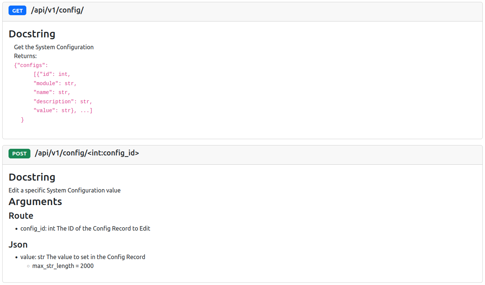

# Flask Parameter Validation
### Get and validate all Flask input parameters with ease.

## Install
* Pip: Install with `pip install flask_parameter_validation`.
* Manually:
  - `git clone https://github.com/Ge0rg3/flask-parameter-validation.git`
  - `python setup.py install`

## Usage Example
```py
from flask import Flask
from typing import List, Optional
from flask_parameter_validation import ValidateParameters, Route, Json, Query
from datetime import datetime

app = Flask(__name__)

@app.route("/update/<int:id>", methods=["POST"])
@ValidateParameters()
def hello(
        id: int = Route(),
        username: str = Json(min_str_length=5, blacklist="<>"),
        age: int = Json(min_int=18, max_int=99),
        nicknames: List[str] = Json(),
        date_of_birth: datetime = Json(),
        password_expiry: Optional[int] = Json(5),
        is_admin: bool = Query(False),
        user_type: str = Json(alias="type")
     ):
    return "Hello World!"


if __name__ == "__main__":
    app.run()
```

## Usage
To validate parameters with flask-parameter-validation, two conditions must be met. 
1. The `@ValidateParameters()` decorator must be applied to the function
2. Type hints ([supported types](#type-hints-and-accepted-input-types)) and a default of a subclass of `Parameter` must be supplied per parameter flask-parameter-validation parameter


### Enable and customize Validation for a Route with the @ValidateParameters decorator
The `@ValidateParameters()` decorator takes parameters that alter route validation behavior or provide documentation information:

| Parameter         | Type                 | Default | Description                                                                                                                  |
|-------------------|----------------------|---------|------------------------------------------------------------------------------------------------------------------------------|
| error_handler     | `Optional[Response]` | `None`  | Overwrite the output format of generated errors, see [Overwriting Default Errors](#overwriting-default-errors) for more      |

#### Overwriting Default Errors
By default, the error messages are returned as a JSON response, with the detailed error in the "error" field, eg:
```json
{
    "error": "Parameter 'age' must be type 'int'"
}
```

However, this can be edited by passing a custom error function into the `ValidateParameters()` decorator. For example:
```py
def error_handler(err):
    error_name = type(err)
    error_parameters = err.args
    error_message = str(err)
    return {
        "error_name": type(err).__name__,
        "error_parameters": err.args,
        "error_message": str(err)
    }, 400

@app.route(...)
@ValidateParameters(error_handler)
def api(...)
```

### Specify Parameter types and constraints with type hints and subclasses of Parameter
#### Parameter Class
The `Parameter` class provides a base for validation common among all input types, all location-specific classes extend `Parameter`. These subclasses are:

| Subclass Name | Input Source                                                                                                           | Available For    |
|---------------|------------------------------------------------------------------------------------------------------------------------|------------------|
| Route         | Parameter passed in the pathname of the URL, such as `/users/<int:id>`                                                 | All HTTP Methods |
| Form          | Parameter in an HTML form or a `FormData` object in the request body, often with `Content-Type: x-www-form-urlencoded` | POST Methods     |
| Json          | Parameter in the JSON object in the request body, must have header `Content-Type: application/json`                    | POST Methods     |
| Query         | Parameter in the query of the URL, such as /news_article?id=55                                                         | All HTTP Methods |
| File          | Parameter is a file uploaded in the request body                                                                       | POST Method      |
| MultiSource   | Parameter is in one of the locations provided to the constructor                                                       | Dependent on selected locations |

Note: "**POST Methods**" refers to the HTTP methods that send data in the request body, such as POST, PUT, PATCH and DELETE. Although sending data via some methods such as DELETE is not standard, it is supported by Flask and this library.

##### MultiSource Parameters
Using the `MultiSource` parameter type, parameters can be accepted from any combination of `Parameter` subclasses. Example usage is as follows:

```py
@app.route("/")
@app.route("/<v>")  # If accepting parameters by Route and another type, a path with and without that Route parameter must be specified
@ValidateParameters()
def multi_source_example(
        value: int = MultiSource(Route, Query, Json, min_int=0)
)
```

The above example will accept parameters passed to the route through Route, Query, and JSON Body.


Note: "**POST Methods**" refers to the HTTP methods that send data in the request body, such as POST, PUT, PATCH and DELETE. Although sending data via some methods such as DELETE is not standard, it is supported by Flask and this library.

#### Type Hints and Accepted Input Types
Type Hints allow for inline specification of the input type of a parameter. Some types are only available to certain `Parameter` subclasses.

| Type Hint / Expected Python Type   | Notes                                                                                                                                       | `Route` | `Form` | `Json` | `Query` | `File` |
|------------------------------------|---------------------------------------------------------------------------------------------------------------------------------------------|---------|--------|--------|---------|--------|
| `str`                              |                                                                                                                                             | Y       | Y      | Y      | Y       | N      |
| `int`                              |                                                                                                                                             | Y       | Y      | Y      | Y       | N      |
| `bool`                             |                                                                                                                                             | Y       | Y      | Y      | Y       | N      |
| `float`                            |                                                                                                                                             | Y       | Y      | Y      | Y       | N      |
| `typing.List` (must not be `list`) | For `Query` and `Form` inputs, users can pass via either `value=1&value=2&value=3`, or `value=1,2,3`, both will be transformed to a `list`. | N       | Y      | Y      | Y       | N      |
| `typing.Union`                     | Cannot be used inside of `typing.List`                                                                                                      | Y       | Y      | Y      | Y       | N      |
| `typing.Optional`                  |                                                                                                                                             | Y       | Y      | Y      | Y       | Y      |
| `datetime.datetime`                | Received as a `str` in ISO-8601 date-time format                                                                                            | Y       | Y      | Y      | Y       | N      |
| `datetime.date`                    | Received as a `str` in ISO-8601 full-date format                                                                                            | Y       | Y      | Y      | Y       | N      |
| `datetime.time`                    | Received as a `str` in ISO-8601 partial-time format                                                                                         | Y       | Y      | Y      | Y       | N      |
| `dict`                             | For `Query` and `Form` inputs, users should pass the stringified JSON                                                                       | N       | Y      | Y      | Y       | N      |
| `FileStorage`                      |                                                                                                                                             | N       | N      | N      | N       | Y      |

These can be used in tandem to describe a parameter to validate: `parameter_name: type_hint = ParameterSubclass()`
- `parameter_name`: The field name itself, such as username
- `type_hint`: The expected Python data type
- `ParameterSubclass`: An instance of a subclass of `Parameter`

### Validation with arguments to Parameter
Validation beyond type-checking can be done by passing arguments into the constructor of the `Parameter` subclass. The arguments available for use on each type hint are:

| Parameter Name    | Type of Parameter                           | Effective On Types    | Description                                                                                                                                                        |
|-------------------|---------------------------------------------|-----------------------|--------------------------------------------------------------------------------------------------------------------------------------------------------------------|
| `default`         | any                                         | All                   | Specifies the default value for the field, makes non-Optional fields not required                                                                                  |
| `min_str_length`  | `int`                                       | `str`                 | Specifies the minimum character length for a string input                                                                                                          |
| `max_str_length`  | `int`                                       | `str`                 | Specifies the maximum character length for a string input                                                                                                          |
| `min_list_length` | `int`                                       | `typing.List`         | Specifies the minimum number of elements in a list                                                                                                                 | 
| `max_list_length` | `int`                                       | `typing.List`         | Specifies the maximum number of elements in a list                                                                                                                 | 
| `min_int`         | `int`                                       | `int`                 | Specifies the minimum number for an integer input                                                                                                                  |
| `max_int`         | `int`                                       | `int`                 | Specifies the maximum number for an integer input                                                                                                                  |
| `whitelist`       | `str`                                       | `str`                 | A string containing allowed characters for the value                                                                                                               |
| `blacklist`       | `str`                                       | `str`                 | A string containing forbidden characters for the value                                                                                                             |
| `pattern`         | `str`                                       | `str`                 | A regex pattern to test for string matches                                                                                                                         |
| `func`            | `Callable -> Union[bool, tuple[bool, str]]` | All                   | A function containing a fully customized logic to validate the value. See the [custom validation function](#custom-validation-function) below for usage            |
| `datetime_format` | `str`                                       | `datetime.datetime`   | Python datetime format string datetime format string ([datetime format codes](https://docs.python.org/3/library/datetime.html#strftime-and-strptime-format-codes)) |
| `comment`         | `str`                                       | All                   | A string to display as the argument description in any generated documentation                                                                                     |
| `alias`           | `str`                                       | All but `FileStorage` | An expected parameter name to receive instead of the function name.                                                                                                |
| `json_schema`     | `dict`                                      | `dict`                | An expected [JSON Schema](https://json-schema.org) which the dict input must conform to                                                                            |
| `content_types`   | `list[str]`                                 | `FileStorage`         | Allowed `Content-Type`s                                                                                                                                            |
| `min_length`      | `int`                                       | `FileStorage`         | Minimum `Content-Length` for a file                                                                                                                                |
| `max_length`      | `int`                                       | `FileStorage`         | Maximum `Content-Length` for a file                                                                                                                                |

These validators are passed into the `Parameter` subclass in the route function, such as:
* `username: str = Json(default="defaultusername", min_length=5)`
* `profile_picture: werkzeug.datastructures.FileStorage = File(content_types=["image/png", "image/jpeg"])`
* `filter: str = Query()`

#### Custom Validation Function

Custom validation functions passed into the `func` property can be used to validate an input against custom logic and return customized error responses for that validation

Example custom validation functions are below:
```py
def is_even(val: int):
    """Return a single bool, True if valid, False if invalid"""
    return val % 2 == 0

def is_odd(val: int):
    """Return a tuple with a bool, as above, and the error message if the bool is False"""
    return val % 2 != 0, "val must be odd"
```

### API Documentation
Using the data provided through parameters, docstrings, and Flask route registrations, Flask Parameter Validation can generate API Documentation in various formats. 
To make this easy to use, it comes with a `Blueprint` and the output and configuration options below:

#### Format
* `FPV_DOCS_SITE_NAME: str`: Your site's name, to be displayed in the page title, default: `Site`
* `FPV_DOCS_CUSTOM_BLOCKS: array`: An array of dicts to display as cards at the top of your documentation, with the (optional) keys:
  * `title: Optional[str]`: The title of the card
  * `body: Optional[str] (HTML allowed)`: The body of the card
  * `order: int`: The order in which to display this card (out of the other custom cards)
* `FPV_DOCS_DEFAULT_THEME: str`: The default theme to display in the generated webpage

#### Included Blueprint
The documentation blueprint can be added using the following code:
```py
from flask_parameter_validation.docs_blueprint import docs_blueprint
...
app.register_blueprint(docs_blueprint)
```

The default blueprint adds two `GET` routes:
* `/`: HTML Page with Bootstrap CSS and toggleable light/dark mode
* `/json`: Non-standard Format JSON Representation of the generated documentation

The `/json` route yields a response with the following format:
```json
{
  "custom_blocks": "<array entered in the FPV_DOCS_CUSTOM_BLOCKS config option, default: []>",
  "default_theme": "<string entered in the FPV_DOCS_DEFAULT_THEME config option, default: 'light'>",
  "docs": "<see get_route_docs() return value format below>",
  "site_name": "<string entered in the FPV_DOCS_SITE_NAME config option, default: 'Site'"
}
```

##### Example with included Blueprint
Code:
```py
@config_api.get("/")
@ValidateParameters()
def get_all_configs():
    """
    Get the System Configuration
    Returns:
    <code>{"configs":
        [{"id": int,
        "module": str,
        "name": str,
        "description": str,
        "value": str}, ...]
    }</code>
    """
    system_configs = []
    for system_config in SystemConfig.query.all():
        system_configs.append(system_config.toDict())
    return resp_success({"configs": system_configs})


@config_api.post("/<int:config_id>")
@ValidateParameters()
def edit_config(
        config_id: int = Route(comment="The ID of the Config Record to Edit"),
        value: str = Json(max_str_length=2000, comment="The value to set in the Config Record")
):
    """Edit a specific System Configuration value"""
    config = SystemConfig.get_by_id(config_id)
    if config is None:
        return resp_not_found("No link exists with ID " + str(config_id))
    else:
        config.update(value)
        return resp_success()
```
Documentation Generated:



##### Custom Blueprint
If you would like to use your own blueprint, you can get the raw data from the following function:
```py
from flask_parameter_validation.docs_blueprint import get_route_docs
...
get_route_docs()
```

###### get_route_docs() return value format
This method returns an object with the following structure:

```json
[
  {
    "rule": "/path/to/route",
    "methods": ["HTTPVerb"],
    "docstring": "String, unsanitized of HTML Tags",
    "decorators": ["@decorator1", "@decorator2(param)"],
    "args": {
      "<Subclass of Parameter this route uses>": [
        {
          "name": "Argument Name",
          "type": "Argument Type",
          "loc_args": {
            "<Name of argument passed to Parameter Subclass>": "Value passed to Argument",
            "<Name of another argument passed to Parameter Subclass>": 0
          }
        }
      ],
      "<Another Subclass of Parameter this route uses>": []
    }
  },
  
  ...
]
```


### JSON Schema Validation
An example of the [JSON Schema](https://json-schema.org) validation is provided below:
```python
json_schema = {
    "type": "object",
    "required": ["user_id", "first_name", "last_name", "tags"],
    "properties": {
        "user_id": {"type": "integer"},
        "first_name": {"type": "string"},
        "last_name": {"type": "string"},
        "tags": {
            "type": "array",
            "items": {"type": "string"}
        }
    }
}

@api.get("/json_schema_example")
@ValidateParameters()
def json_schema(data: dict = Json(json_schema=json_schema)):
    return jsonify({"data": data})
```

## Contributions
Many thanks to all those who have made contributions to the project:
* [d3-steichman](https://github.com/d3-steichman)/[smt5541](https://github.com/smt5541): API documentation, custom error handling, datetime validation and bug fixes
* [summersz](https://github.com/summersz): Parameter aliases, async support, form type conversion and list bug fixes
* [Garcel](https://github.com/Garcel): Allow passing custom validator function
* [iml1111](https://github.com/iml1111): Implement regex validation
* [borisowww](https://github.com/borisowww): Fix file handling bugs
* [Charlie-Mindified](https://github.com/Charlie-Mindified): Fix JSON handling bug
* [dkassen](https://github.com/dkassen): Helped to resolve broken list parsing logic

